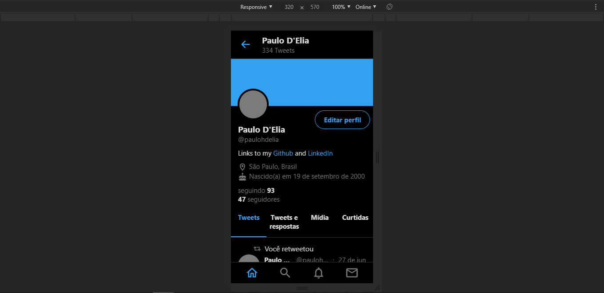
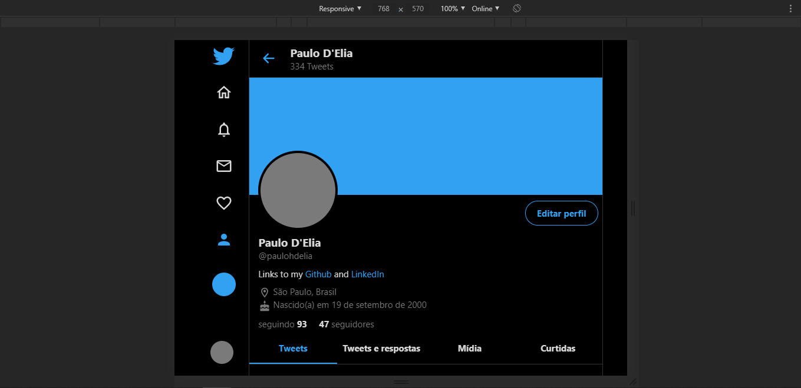
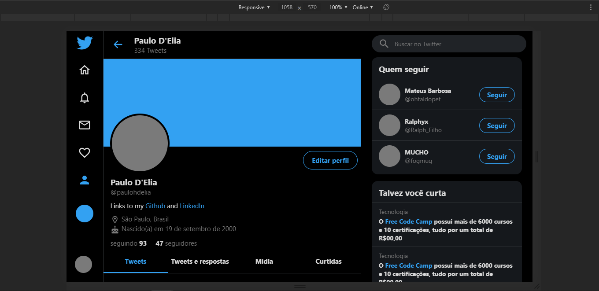
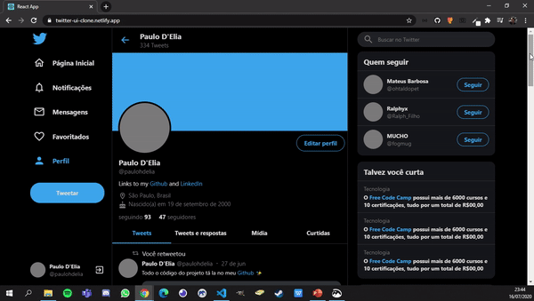

<h1 align="center">
UI Clone - Twitter Responsive
</h1>

Responsive Twitter UI Clone (partial) for study purposes.

Deployed <a href="https://twitter-ui-clone.netlify.app/">here</a>.

  
  

## Techs

- [x] React.js
- [x] Styled Components
- [x] TypeScript

## Responsiveness

<h3 align="center">Mobile</h3>

<h3 align="center">Tablet</h3>

<h3 align="center">Laptop Small Screen</h3>

<h3 align="center">Laptop Normal/Large Screen</h3>

## Sticky Box Feature

## Usage

1. Run `npm install` or `yarn install`. 
2. Run `yarn start` and access `http://localhost:3000`. 

## Acknowledgments

This Twitter clone was made following the video [Twitter Responsivo com ReactJS | UI Clone](https://www.youtube.com/watch?v=K-8z_4xvT3o) by [Guilherme Rodz](https://github.com/guilhermerodz) from [Rocketseat](https://github.com/Rocketseat)
